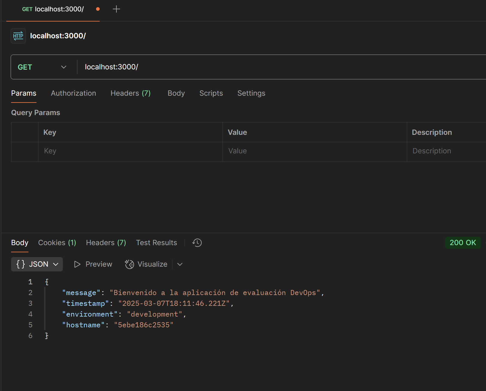

# ArquitecturaSFV-P1

# Evaluación Práctica - Ingeniería de Software V

## Información del Estudiante
- **Nombre: Alejandro Londoño Bermúdez**
- **Código: A00395978**
- **Fecha: 07/03/2025**

## Resumen de la Solución
[Breve descripción de tu implementación]

## Dockerfile
Instalé nodejs en su versión LTS y configuré de forma básica por la naturaleza de la aplicación

Creación de la imágen

Creación del contenedor

Revisión de que el programa corre

## Script de Automatización

## Principios DevOps Aplicados
1. Aprendizaje continuo
2. Agilismo
3. Integración continua

## Captura de Pantalla

## Mejoras Futuras
agregar seguridad
agregar mayores excepciones
## Instrucciones para Ejecutar
Dar permisos para ejecutar el .sh y correrlo

